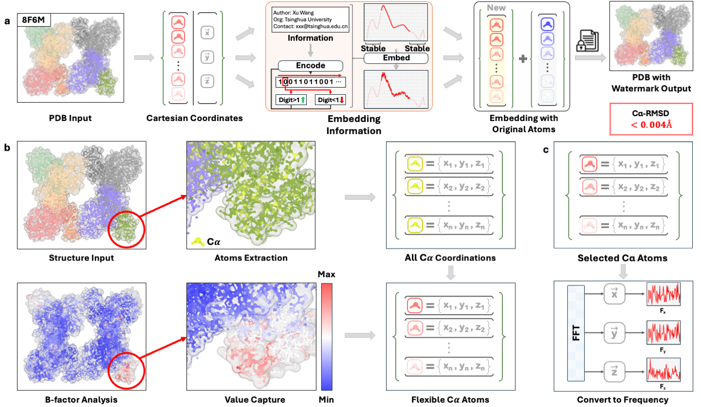
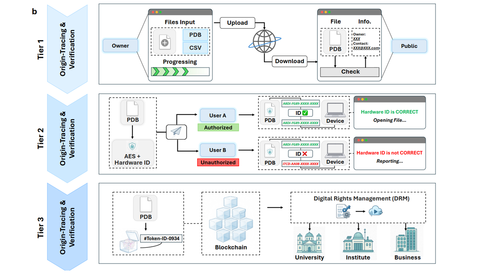

# StrucTrace: A Universal Fourier Watermark for Traceable Biomolecular Structures

[](https://opensource.org/licenses/MIT)
[](https://www.python.org/downloads/release/python-380/)
[](https://www.gromacs.org/)

**Authors:** Xu Wang, Chi Wang, Tin-Yeh Huang, Yiquan Wang, Yafei Yuan*


---

## 📖 Overview

**StrucTrace** is a universal, post-processing watermarking framework designed to transform biomolecular structures (Cryo-EM, AlphaFold, RFdiffusion, etc.) into traceable, secure, and auditable digital assets.

As AI-generated proteins become indistinguishable from natural ones, protecting digital biomolecular intellectual property (IP) is critical. Unlike generation-coupled methods that introduce notable structural deviations (RMSD ≈ 2.0 Å), **StrucTrace** leverages **Fourier-domain geometric modulation** to embed data. It achieves **100% bit recovery** while maintaining **functionally imperceptible structural perturbations** (scRMSD ≤ 0.0015 Å), ensuring atomic-level precision for downstream applications like molecular dynamics and docking.

### Framework Workflow
The algorithm utilizes a deterministic workflow that decouples protection from generation. It targets thermodynamically flexible regions (identified via DSSP and B-factor analysis) and modulates mid-frequency coefficients to distribute information globally without affecting the core fold.


> **Figure 1: The universal Fourier-domain watermarking framework.** (a) Schematic of the complete pipeline. (b) Deterministic atom selection integrates DSSP and B-factor analysis to isolate flexible $C_{\alpha}$ atoms (red). (c) FFT-based encoding modulates mid-frequency bands to embed data while preserving global structural integrity.

---

## 🚀 Key Features

* **Universal Compatibility**: Validated on diverse asset classes: Natural proteins (e.g., 8HFE), Physics-based designs (Rosetta), and AI-generated structures (RFdiffusion).
* **Zero-Distortion**: Median $C_\alpha$-RMSD < 0.004 Å and side-chain RMSD ≤ 0.0015 Å, effectively invisible to standard structural analysis tools.
* **Thermodynamic Stability**: Watermarked structures exhibit thermodynamic neutrality ($\Delta\Delta G \approx 0$).
* **High Capacity**: Capable of embedding extensive metadata (e.g., >6,000 bits) into complex structures without compromising experimental resolution.
* **Multi-Tiered Security**: Integrates public provenance tracking, hardware-bound access control, and blockchain-based DRM.

---

## 📊 Universality & Stability Validation

To validate the universality of StrucTrace across distinct eras of structural biology, we performed **50 ns Molecular Dynamics (MD) simulations** on three representative test cases:
1.  **Natural Protein:** Human Norepinephrine Transporter (PDB: **8HFE**).
2.  **Physics-based Design:** *De novo* protein designed via Rosetta (PDB: **6MRR**).
3.  **AI-Generated:** Heme-binder generated via RFdiffusion (PDB: **8VC8**).


> **Figure 2: Universality and consistent structural integrity.** (a) Global RMSD distributions showing negligible perturbation (<0.0015 Å). (b) Thermodynamic neutrality ($\Delta\Delta G \approx 0$). (c-e) Comparative 50 ns MD trajectories confirming that watermarked structures (blue) retain dynamic stability statistically indistinguishable from original structures (green).

---

## 🧬 High-Capacity Embedding (Stress Test)

StrucTrace can transform PDB files into self-contained data capsules. We demonstrated this by embedding a **complete research abstract (6,584 bits)** into the 2.6 Å Cryo-EM structure of the human $\gamma$-secretase tetramer (PDB: 6IYC).


> **Figure 3: High-density information embedding in a complex Cryo-EM target.** The payload (6,584 bits) was distributed across 4,400 high B-factor atoms. The resulting structure maintained a global RMSD of **0.017 Å**, two orders of magnitude smaller than the experimental resolution, with 100% bit recovery.

---

## 🛡️ Multi-Tiered Security Ecosystem

StrucTrace establishes a scalable infrastructure for bio-asset management through a three-tiered architecture:

* **Tier 1 (Public Provenance):** Lightweight signature verification using high-speed alignment tools (Foldseek).
* **Tier 2 (Hardware-Bound Access):** AES-256 encryption bound to physical device identifiers ($ID_{machine}$) to prevent unauthorized exfiltration.
* **Tier 3 (Digital Rights Management):** Blockchain-based tokenization for commercial licensing and immutable audit trails.


> **Figure 4: Technical workflows for the multi-tiered security ecosystem.** Top: Public verification workflow. Middle: Hardware-bound mechanism (Tier 2) validating unique device IDs. Bottom: Tokenized transaction flow on the blockchain (Tier 3).

---

## 🔬 Reproducibility: GROMACS MD Protocol

To ensure reproducibility of our stability results, we provide the exact molecular dynamics protocol used in the paper.

**Simulation Parameters:**
* **Software:** GROMACS v2024.6
* **Force Field:** AMBER99SB-ILDN
* **Water Model:** TIP3P (Cubic box)
* **Ions:** Neutralized with 0.15 M NaCl ($Na^+/Cl^-$)
* **Ensembles:** NVT (V-rescale) & NPT (Parrinello-Rahman)
* **Duration:** 50 ns production run per system

The detailed protocol is provided in \Molecular Dynamics Validation\configs
---

## 🛠️ Installation & Usage

### Prerequisites
* Python 3.8+
* Numpy, Biopython, Scipy
* DSSP (for secondary structure assignment)

# Clone the repository
git clone [https://github.com/YourUsername/StrucTrace.git](https://github.com/YourUsername/StrucTrace.git)
cd StrucTrace

---

## 📚 Citation

If you use StrucTrace in your research, please cite our paper:

```bibtex
@article{Wang2025StrucTrace,
  title={StrucTrace: A universal Fourier watermark for traceable biomolecular structures},
  author={Wang, Xu and Wang, Chi and Huang, Tin-Yeh and Wang, Yiquan and Yuan, Yafei},
  journal={Nature Structural & Molecular Biology, Technical Report},
  year={2025},
  note={Under Review}
}

```

---

## 📄 License

This project is licensed under the **MIT License** - see the [LICENSE](https://www.google.com/search?q=LICENSE) file for details.

