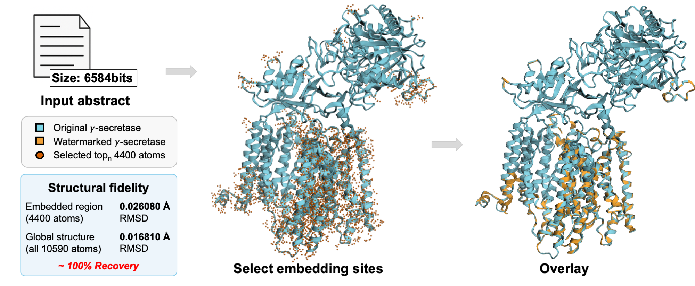
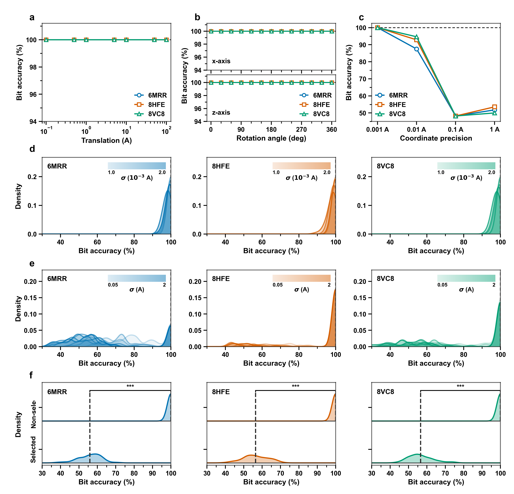
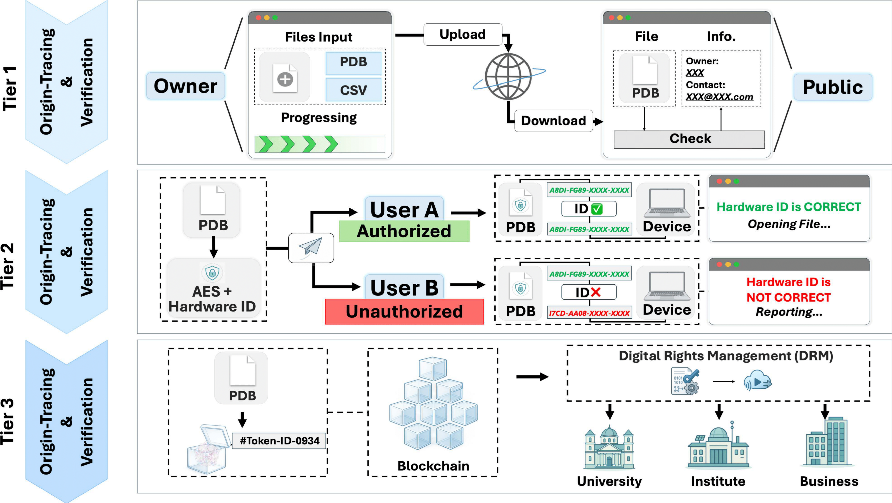

# StrucTrace: A Universal Fourier Watermark for Traceable Biomolecular Structures

[](https://opensource.org/licenses/MIT)
[](https://www.python.org/)
[](https://www.gromacs.org/)

**Authors:** *Xu Wang*<sup>&dagger;,*</sup>, *Chi Wang*<sup>&dagger;</sup>, *Tin-Yeh Huang*, *Yiquan Wang*, *Yafei Yuan*<sup>*</sup>  
<sup>&dagger;</sup>These authors contributed equally to this work.  
<sup>*</sup>Corresponding authors.

StrucTrace is a reference-guided Fourier-domain watermarking framework for traceable biomolecular structures. It embeds provenance payloads into flexible C-alpha coordinate regions as a post-processing step, preserving atomic-scale structural fidelity while enabling public provenance verification, hardware-bound access control and auditable digital-rights management.

## Key Results

- Universal post-processing watermarking for deposited PDB files, cryo-EM structures and AI-designed proteins.
- 100% bit recovery in fidelity benchmarks, with side-chain RMSD no greater than 0.0015 Angstrom.
- High-capacity embedding of a 6,584-bit abstract into the human gamma-secretase cryo-EM structure.
- Defined recovery boundaries under rigid-body transformations, coordinate rounding, all-atom noise and local C-alpha perturbation.
- Three-tier safeguard model: public provenance, hardware-bound access and digital-rights management.

## Figures


**Figure 1. Universal Fourier-domain watermarking workflow.** StrucTrace selects flexible C-alpha atoms, embeds payload bits by mid-frequency FFT amplitude modulation and reconstructs watermarked coordinates with minimal geometric perturbation.


**Figure 2. Structural fidelity and universality.** Large-scale RMSD and Rosetta-energy analyses show negligible perturbation, and 50 ns MD simulations preserve dynamic behaviour across natural, Rosetta-designed and RFdiffusion-generated proteins.



**Figure 3. High-capacity embedding.** A 6,584-bit abstract was embedded into the human gamma-secretase tetramer while retaining coordinate-level agreement with the original cryo-EM structure.



**Figure 4. Robustness and tamper boundary.** Reference-guided decoding is invariant to rigid-body transformations and standard PDB precision, while all-atom noise, local distortion and selected C-alpha perturbation define the recovery boundary.



**Figure 5. Three-tier safeguards.** Tier 1 provides public provenance verification, Tier 2 provides hardware-bound encrypted access, and Tier 3 provides auditable digital-rights management.

## Install

Clone and install the package in editable mode:

```bash
git clone https://github.com/JLU-WangXu/Structrace.git
cd Structrace
pip install -e .
```

The command-line interface is then available as:

```bash
python -m structrace --help
```

If your Python scripts directory is on `PATH`, you can also use:

```bash
structrace --help
```

External software used for manuscript validation includes DSSP, GROMACS 2024.6, Rosetta and Foldseek.

## Quick Start

### CLI

Embed and decode a text payload:

```bash
python -m structrace embed Robustness/00_baseline_cases/6MRR/6MRR_original.pdb \
  --text "npj SB" \
  -o tmp/6MRR_watermarked.pdb

python -m structrace decode Robustness/00_baseline_cases/6MRR/6MRR_original.pdb \
  tmp/6MRR_watermarked.pdb \
  --bits 56 \
  --expected-text "npj SB"
```

Run simple perturbations:

```bash
python -m structrace attack round tmp/6MRR_watermarked.pdb --decimals 3 -o tmp/6MRR_round3.pdb
python -m structrace attack translate tmp/6MRR_watermarked.pdb --vector 10 0 0 -o tmp/6MRR_tx10.pdb
python -m structrace attack noise tmp/6MRR_watermarked.pdb --sigma 0.001 --seed 1 -o tmp/6MRR_noise.pdb
```

### Python API

```python
from structrace.watermark import embed_text, decode_text
from structrace.watermark.payload import text_to_bits

master = "Robustness/00_baseline_cases/6MRR/6MRR_original.pdb"
query = "tmp/6MRR_watermarked.pdb"

embed_result = embed_text(master, "npj SB", query)
decode_result = decode_text(master, query, len(text_to_bits("npj SB")), expected_text="npj SB")

print(embed_result.global_ca_rmsd)
print(decode_result.decoded_text, decode_result.bit_accuracy, decode_result.exact_recovery)
```

## Package Functions

### Watermarking

- `embed_bits(input_pdb, bits, output_pdb)`: embed a binary payload into a PDB file.
- `embed_text(input_pdb, text, output_pdb)`: encode UTF-8 text as bits and embed it.
- `decode_bits(master_pdb, query_pdb, bit_length)`: recover bits by reference-guided decoding.
- `decode_text(master_pdb, query_pdb, bit_length)`: recover and decode a UTF-8 payload.
- `text_to_bits(text)`, `bits_to_text(bits)`: payload conversion helpers.

### Robustness

- `round_pdb_coordinates(input_pdb, output_pdb, decimals)`: coordinate precision attack.
- `translate_pdb(input_pdb, output_pdb, vector)`: rigid-body translation.
- `add_gaussian_noise_to_atoms(input_pdb, output_pdb, sigma, seed)`: stochastic coordinate noise.
- `rmsd(a, b)`, `bit_accuracy(expected, decoded)`, `bit_error_rate(expected, decoded)`: analysis metrics.

### Security Safeguards

- `build_public_registry(records, output_csv)`: create Tier 1 provenance records.
- `verify_public_registry(registry_csv)`: verify registered query hashes.
- `machine_fingerprint()`: derive a local machine fingerprint.
- `encrypt_file(input_path, output_path, machine_id=None)`: Tier 2 encrypted asset generation.
- `decrypt_file(input_path, output_path, machine_id=None)`: hardware-bound decryption.
- `audit_artifacts(paths, output_csv=None)`: hash and size audit for protected assets.
- `LedgerEvent(...)`, `build_ledger(events, output_json, output_csv)`, `verify_ledger(ledger_json)`: Tier 3 DRM ledger utilities.

## Repository Map

- `src/structrace/`: installable Python package.
- `Robustness/`: robustness and preliminary watermark-validation examples.
- `Security_Safeguards/`: Tier 1, Tier 2 and Tier 3 safeguard demonstrations.
- `High-density_embedding_stress_test/`: gamma-secretase high-capacity embedding case.
- `Molecular_Dynamics_Validation/`: MD inputs, structures and analysis outputs.
- `Bit_RMSD/` and `Bit_Rosetta_energy/`: large-scale fidelity benchmark tables.
- `Figs/Figs/`: revised manuscript figures.
- `docs/`: package implementation log and extended API examples.

## Citation

```bibtex
@article{Wang2026StrucTrace,
  title  = {StrucTrace: A Universal Fourier Watermark for Traceable Biomolecular Structures},
  author = {Wang, Xu and Wang, Chi and Huang, Tin-Yeh and Wang, Yiquan and Yuan, Yafei},
  year   = {2026},
  note   = {Manuscript under review}
}
```
